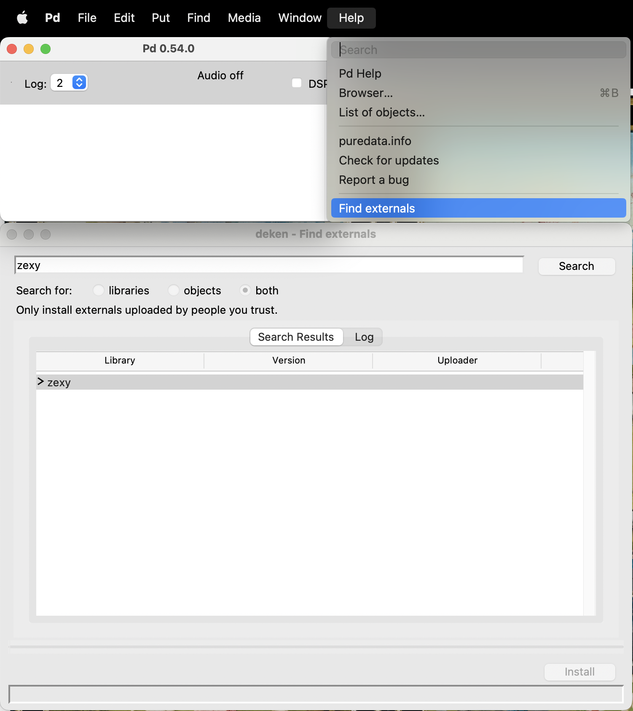
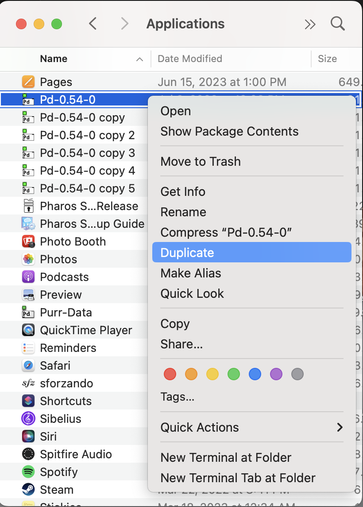
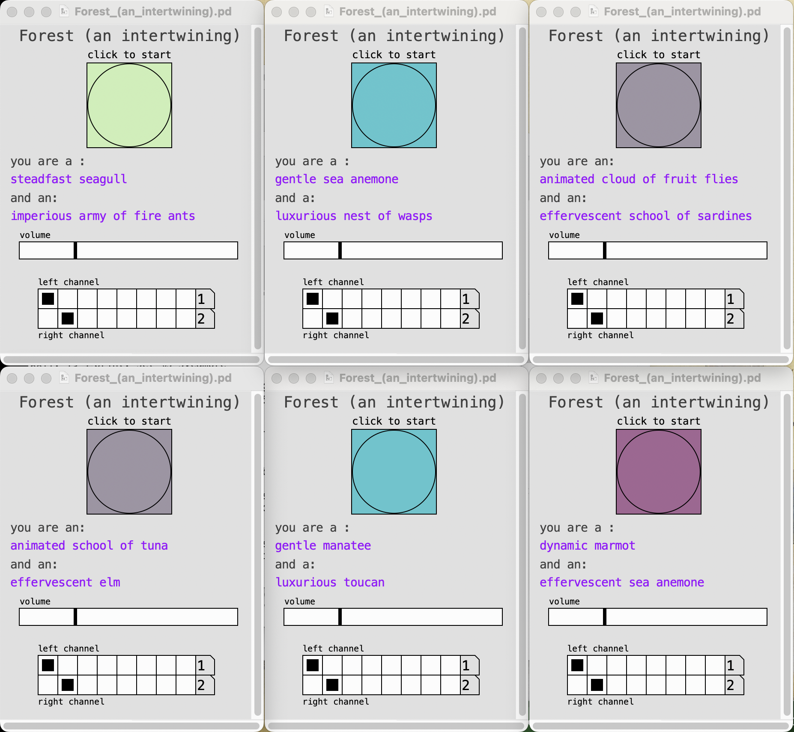
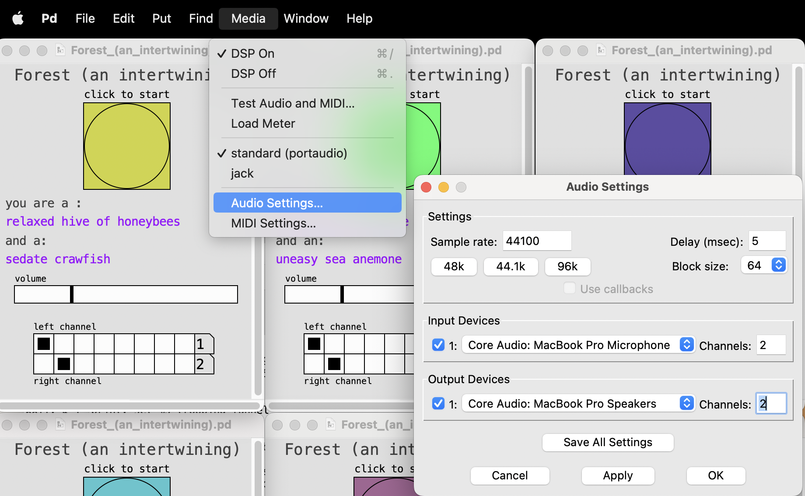
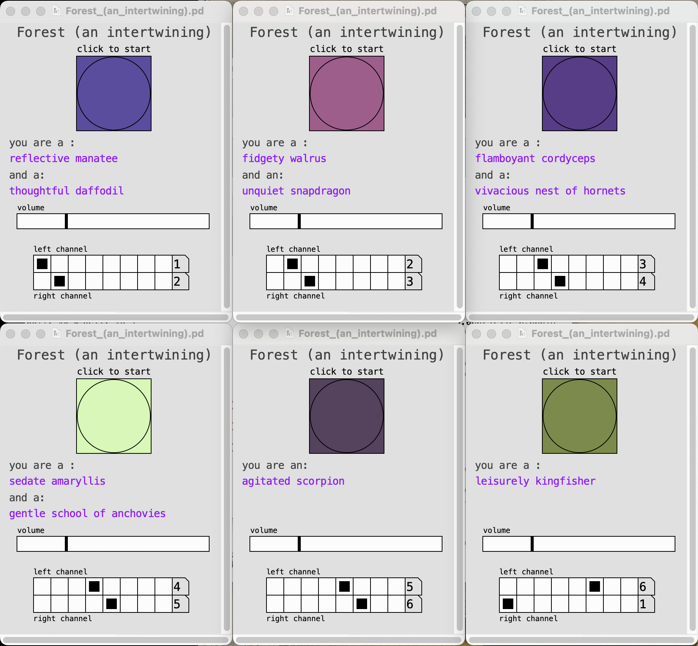

# Forest (an intertwining)

## Creating the Electronic Soundscape

1. Download [Pure Data](https://puredata.info/downloads/pure-data).

2. Go to Help => Find externals and search for "zexy". Install "zexy".

3. Duplicate the Pure Data application 5 times.

4. Download Forest_(an_intertwining).pd from this repository.

5. Open all 6 instances of Pure Data and open Forest_(an_intertwining).pd with each of them. Click the button to start each one.

6. Go to Media => Audio Settings, and select the audio interface and the appropriate number of channels.

7. Select output channels for each patch to ensure a broad spatial situation. For 6 channels, something like this would be appropriate.

8. To create a fuller texture, you can create more copies of Pure Data and open more instances of Forest_(an_intertwining).pd. 

9. If there are issues with clicking and audio dropouts, you can increase the Delay time in Media => Audio Settings.
